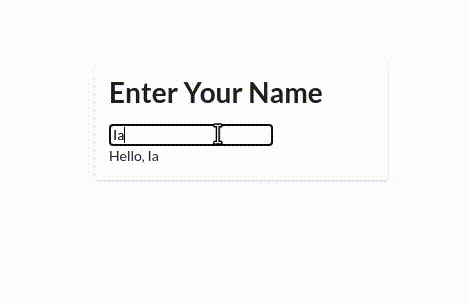

# Kweb 🦆

<div align="center">
  <!-- Github Actions -->
  <a href="https://github.com/kwebio/kweb-core/actions/workflows/build.yml">
    
  </a>
  <a href="https://matrix.to/#/#kweb:matrix.org">
    
  </a>
  <a href="https://jitpack.io/#kwebio/kweb-core">
    
  </a>
</div>

## Quick Start

Read the [Introduction](https://docs.kweb.io/book/intro.html) or [Getting Started](https://docs.kweb.io/book/gettingstarted.html) from the [Kweb Book](https://docs.kweb.io/book/).

## Overview

Kweb is a new way to create beautiful, efficient, and scalable websites in [Kotlin](https://kotlinlang.org/), where server-browser communication is handled automatically.

## Example

```kotlin
import kweb.*
import kweb.InputType.text
import kweb.plugins.fomanticUI.fomantic
import kweb.plugins.fomanticUI.fomanticUIPlugin

fun main(args: Array<String>) {
    Kweb(port = 16097, plugins = listOf(fomanticUIPlugin)) {
        doc.body {
            div(fomantic.ui.segment) {
                h1().text("Enter Your Name")
                val nameInput = input(type = text)
                br()
                span().text(nameInput.value.map { "Hello, $it" })
            }
        }
    }
}
```

### Result

This demo illustrates [creating DOM elements](https://docs.kweb.io/book/dom.html#creating-dom-elements-and-fragments),
[modifying elements](https://docs.kweb.io/book/dom.html#adding-attributes), 
[KVars](https://docs.kweb.io/book/state.html#building-blocks), and binding 
[input elements](https://docs.kweb.io/book/dom.html#input-elements).



## Learn More

* [The Kweb Book](http://docs.kweb.io/book) (user manual)
* [API Documentation](https://docs.kweb/io/api)
* [Example Project](https://github.com/freenet/freenetorg-website/tree/staging/src/main/kotlin/org/freenet/website)
* [Template Repo](https://github.com/kwebio/kweb-template)
* [Examples](https://github.com/kwebio/kweb-demos)
* [Questions, Feedback, Bugs](https://github.com/kwebio/kweb-core/issues)
* [Chat with us](https://matrix.to/#/#kweb:matrix.org)
* [Frequently Asked Questions](https://docs.kweb.io/book/faq.html)
